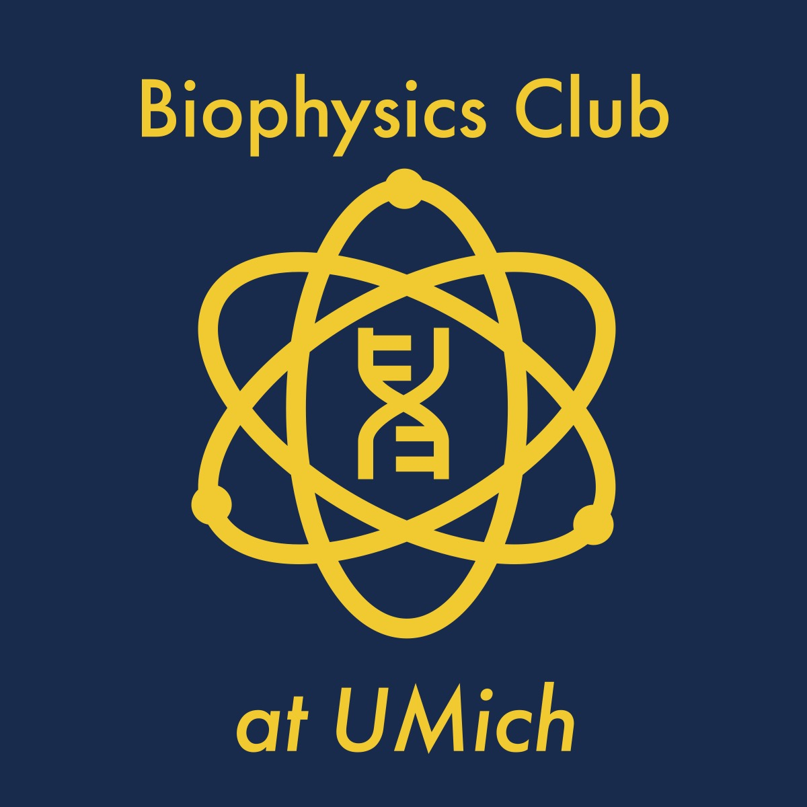

<h2 style="color:#387499;">About</h2>

Biophysics is the branch of knowledge that applies the principles of physics and chemistry and the methods of mathematical analysis and computer modeling to understand how biological systems work. The Biophysics club is open to anyone interested in Biophysics! As a club, we have meetings every week to discuss research done in the field and to hear about each others' experience with biophysics. We also have other events like movie/game nights and study sessions! This club also can be the opportunity to connect to a worldwide community of Biophysicists through the Biophysical Society (BPS). Come meet people who share the same interest and passion! And learn more about what biophysics has to offer you and the world

<h2 style="color:#387499;">Events</h2>

### Thursday, September 1 — Festifall from 5:30 to 8 at table F34
### Tuesday, September 6 — First Meeting! Starts at 7 in the Biophysics Lounge (Chem 4041)
This first meeting of the year is for all who wish to learn more about biophysics or who are interested in learning more about the club. It will be a fun time! Pizza will be provided.

<h2 style="color:#387499;">Join</h2>

* [Instagram](https://www.instagram.com/umich_biophysics_club/)
* [Discord](https://discord.gg/vMwssCNa5k)
* [Interest Form](https://forms.gle/di5YEcsJMRqbZVG98)

<h2 style="color:#387499;">Contact</h2>

Contact mhabra@umich.edu or biophysicsclub1@gmail.com if you have any questions :)

